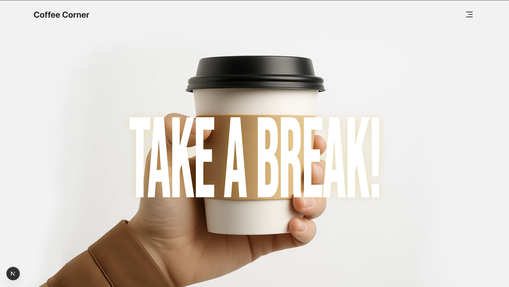
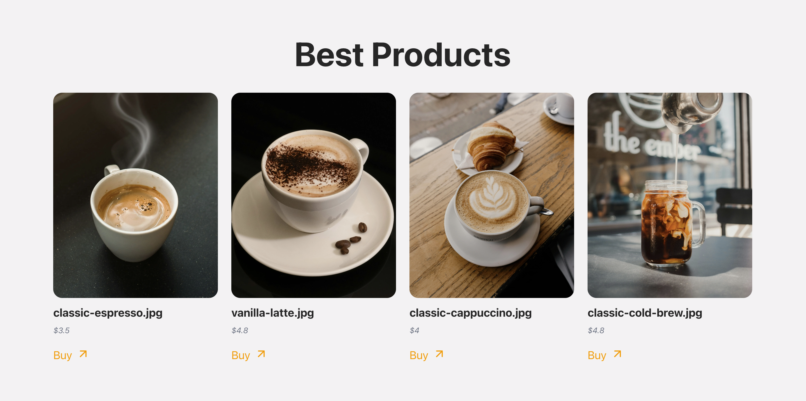
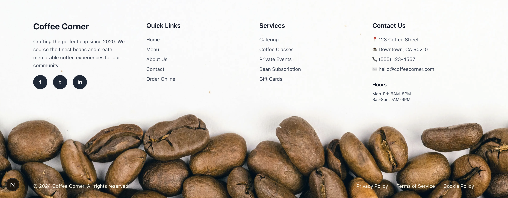

# ☕ Coffee Corner

A modern coffee shop website built with Next.js frontend and Node.js backend API.







## 🚀 Quick Start

### Prerequisites

- **Node.js** (version 18.0.0 or higher)
- **npm** or **yarn**
- **MongoDB** database (local or cloud)

### Backend Setup

1. **Navigate to backend directory:**

   ```bash
   cd backend
   ```

2. **Install dependencies:**

   ```bash
   npm install
   ```

3. **Environment Configuration:**
   Create a `.env` file in the backend directory:

   ```env
   MONGO_URI=your_mongodb_connection_string
   PORT=3001
   API_URL=/api/v1
   ```

4. **Start the server:**

   ```bash
   # Development mode (with auto-reload)
   npm run dev

   # Production mode
   npm start
   ```

   The backend will run on `http://localhost:3001`

### Frontend Setup

1. **Navigate to frontend directory:**

   ```bash
   cd frontend
   ```

2. **Install dependencies:**

   ```bash
   npm install
   ```

3. **Start the development server:**

   ```bash
   npm run dev
   ```

   The frontend will run on `http://localhost:3000`

## 🏗️ Project Structure

```
coffee-corner/
├── backend/                 # Node.js API server
│   ├── app.js             # Main server file
│   ├── routers/           # API route handlers
│   ├── model/             # MongoDB models
│   ├── helpers/           # Utility functions
│   └── data/              # Sample data files
├── frontend/               # Next.js React application
│   ├── app/               # App router components
│   ├── components/        # Reusable UI components
│   └── public/            # Static assets
└── README.md              # This file
```

## 🔧 Backend API Endpoints

- **Health Check:** `GET /api/v1/health`
- **Products:** `GET/POST/PUT/DELETE /api/v1/products`
- **Categories:** `GET/POST/PUT/DELETE /api/v1/categories`
- **Users:** `GET/POST/PUT/DELETE /api/v1/users`
- **Orders:** `GET/POST/PUT/DELETE /api/v1/orders`

## 🎨 Frontend Features

- **Modern UI/UX** with Tailwind CSS
- **Responsive Design** for all devices
- **Component-based Architecture** with React
- **TypeScript** for type safety
- **Next.js 15** with App Router

## 🛠️ Technologies Used

### Backend

- **Node.js** - Runtime environment
- **Express.js** - Web framework
- **MongoDB** - Database
- **Mongoose** - ODM for MongoDB
- **JWT** - Authentication
- **bcryptjs** - Password hashing
- **CORS** - Cross-origin resource sharing

### Frontend

- **Next.js 15** - React framework
- **React 19** - UI library
- **TypeScript** - Type safety
- **Tailwind CSS** - Utility-first CSS framework
- **Lucide React** - Icon library

## 📱 Available Scripts

### Backend

```bash
npm run dev      # Start development server with nodemon
npm start        # Start production server
npm run build    # Build the project (no build step required)
```

### Frontend

```bash
npm run dev      # Start development server
npm run build    # Build for production
npm start        # Start production server
npm run lint     # Run ESLint
```

## 🌐 Environment Variables

### Backend (.env)

```env
MONGO_URI=mongodb://localhost:27017/coffee-corner
PORT=3001
API_URL=/api/v1
```

### Frontend

No environment variables required for basic setup.

## 🚀 Deployment

### Backend

- Can be deployed to any Node.js hosting service
- Ensure MongoDB connection is accessible
- Set appropriate environment variables

### Frontend

- Optimized for Vercel deployment
- Static assets are automatically optimized
- Built with Next.js for optimal performance

---

**Note:** Make sure to replace `your_mongodb_connection_string` with your actual MongoDB connection string before running the backend.
